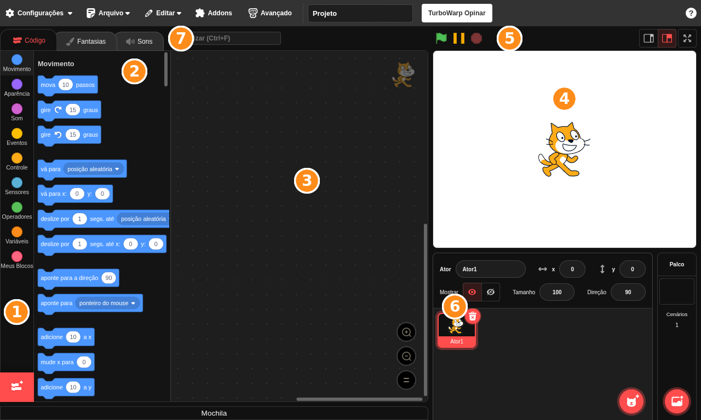

---slide--- title-slide

# Programação para crianças

## Aula 1 — O computador e o nosso primeiro programa 🐱

---slide---

# Bem-vindos! 👋

Neste curso vamos:

- 🎮 **criar jogos e animações** no Scratch
- 📐 aprender **matemática** usando o computador
- 🖥️ entender **como o computador funciona**

---slide---

# Nossos combinados

- ✋ levantar a mão para falar
- 🚫🍕 sem comida perto do computador
- 🖱️ pediu atenção? **mãos longe do mouse**
- 🤝 ajudar **explicando**, sem pegar o mouse
- 💡 **errar faz parte!**

---slide---

# O que é um programa? 🤖

Um **programa** é uma **lista de instruções**, **em ordem**.

O computador faz **exatamente** o que mandamos — nem mais, nem menos.

---slide---

# Como o computador funciona

<div class="flow">
<div class="step">ENTRADA<span>⌨️ 🖱️ 🎤</span></div>
<div class="arrow">➡️</div>
<div class="step">PROCESSAMENTO<span>🧠</span></div>
<div class="arrow">➡️</div>
<div class="step">SAÍDA<span>🖥️ 🔊</span></div>
</div>

---slide---

# Por dentro do gabinete

<div class="small-table" markdown="1">

| Peça | É como… |
|---|---|
| **Processador** | 🧠 o cérebro — faz as contas |
| **Memória RAM** | 📚 a mesa de estudo — o que usamos **agora** |
| **SSD / HD** | 🗄️ o armário — guarda mesmo desligado |
| **Placa-mãe** | 🏙️ a cidade — liga todas as peças |
| **Fonte** | ❤️ o coração — manda energia |

</div>

---slide---

# Entrada ou saída? 🤔

<div class="cols big" markdown="1">
<div markdown="1">
⌨️ Teclado

🖥️ Monitor

🔊 Caixa de som
</div>
<div markdown="1">
🎤 Microfone

🖱️ Mouse

📱 Tela do celular?
</div>
</div>

---slide---

# O mouse 🖱️

- botão **esquerdo**: clicar
- **clique duplo**: dois cliques rápidos
- **arrastar**: segurar, mover e **soltar**
- botão **direito**: abre um menu

---slide---

# O teclado ⌨️

- **Espaço**: a tecla comprida
- **Enter**: confirma
- **Backspace** ⌫: apaga
- **Shift** ⇧: letra MAIÚSCULA
- **setas** ⬅️ ⬆️ ➡️ ⬇️

---slide---

# Conhecendo o Scratch

<div class="split" markdown="1">
<div markdown="1">
{.full}
</div>
<div class="small" markdown="1">
1. categorias
2. blocos
3. área de código
4. palco
5. começar / parar
6. atores
7. abas
</div>
</div>

---slide---

# Nosso primeiro programa 🐱

```blocks
quando @greenFlag for clicado
mova (10) passos
diga [Olá, mundo!]
toque o som (Miau v)
```

Depois, clique na **bandeira verde**! 🏁

---slide---

# Agora é com você!

- troque **10** por **100**
- faça o gato falar **o seu nome**
- use `espere 1 seg` e `mova -100 passos`: o gato **vai e volta**

---slide---

# Desafios ⭐

**⭐** Faça o gato **andar de verdade**<br>
💡 `próxima fantasia` e `repita`

**⭐⭐** Faça o gato dar **uma volta inteira**<br>
💡 `gire 15 graus`

---slide---

# Hoje aprendemos 🎉

- um **programa** é uma lista de instruções, em ordem
- o **processador** é o cérebro; a **RAM** é a mesa de estudo
- montamos o nosso **primeiro programa**!

**Próxima aula:** Onde está o gato? 🐱📍 O **endereço** de cada ponto da tela.
