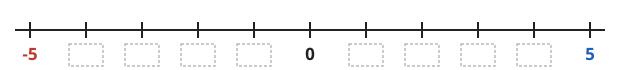
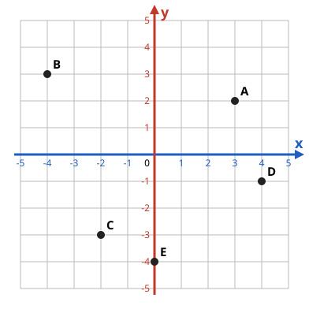
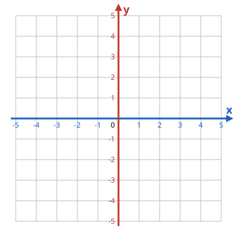
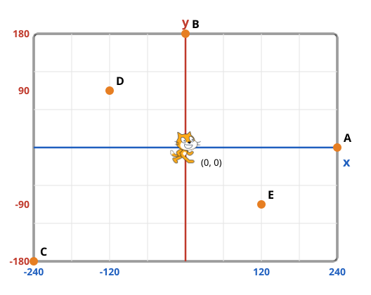

# Ficha 2 — Onde está o gato? 🐱📍

**Nome:** <span class="blank" style="--w:95mm"></span>

<div class="tight" markdown="1">

## 1. Complete a reta numérica

{.full}

**a)** O elevador estava no andar **2** e desceu **3** andares. Em que andar ele parou? <span class="blank" style="--w:25mm"></span>

**b)** Qual é **maior**: **-3** ou **1**? <span class="blank" style="--w:25mm"></span>

**c)** Estava **-2 °C** e esquentou **5 graus**. Quanto ficou? <span class="blank" style="--w:25mm"></span>

## 2. Qual é o endereço de cada ponto?

<div class="box center" markdown="1">
**Primeiro o x: ande para o lado ➡️⬅️ · Depois o y: suba ou desça ⬆️⬇️**
</div>

<div class="cols" markdown="1">
<div markdown="1">
{style="width: 68mm"}
</div>
<div markdown="1">
**A** ( <span class="blank" style="--w:13mm"></span> , <span class="blank" style="--w:13mm"></span> )

**B** ( <span class="blank" style="--w:13mm"></span> , <span class="blank" style="--w:13mm"></span> )

**C** ( <span class="blank" style="--w:13mm"></span> , <span class="blank" style="--w:13mm"></span> )

**D** ( <span class="blank" style="--w:13mm"></span> , <span class="blank" style="--w:13mm"></span> )

**E** ( <span class="blank" style="--w:13mm"></span> , <span class="blank" style="--w:13mm"></span> )
</div>
</div>

## 3. O gato anda com as setas — complete com o número certo

<div class="cols" markdown="1">
<div markdown="1">
```blocks
quando a tecla [seta para direita v] for pressionada
adicione (10) a x
```

```blocks
quando a tecla [seta para esquerda v] for pressionada
adicione () a x
```
</div>
<div markdown="1">
```blocks
quando a tecla [seta para cima v] for pressionada
adicione () a y
```

```blocks
quando a tecla [seta para baixo v] for pressionada
adicione () a y
```
</div>
</div>

</div>

<div class="tight" markdown="1">


## 4. Desenho secreto ✏️ {style="break-before: page"}

Marque os pontos e ligue **na ordem**: A → B → C → D → E → A. O que apareceu?

<div class="cols" markdown="1">
<div markdown="1">
{.full}
</div>
<div markdown="1">
**A** (-3, -3)

**B** (3, -3)

**C** (3, 1)

**D** (0, 4)

**E** (-3, 1)

**É um(a):** <span class="blank" style="--w:40mm"></span>

⭐ Desenhe uma **porta**: ligue (-1, -3) → (-1, -1) → (1, -1) → (1, -3).
</div>
</div>

## 5. O palco do Scratch

O gato começa no **centro (0, 0)**. Escreva o endereço de cada ponto laranja.

<div class="cols" markdown="1">
<div markdown="1">
{.full}
</div>
<div markdown="1">
**A** ( <span class="blank" style="--w:13mm"></span> , <span class="blank" style="--w:13mm"></span> )

**B** ( <span class="blank" style="--w:13mm"></span> , <span class="blank" style="--w:13mm"></span> )

**C** ( <span class="blank" style="--w:13mm"></span> , <span class="blank" style="--w:13mm"></span> )

**D** ( <span class="blank" style="--w:13mm"></span> , <span class="blank" style="--w:13mm"></span> )

**E** ( <span class="blank" style="--w:13mm"></span> , <span class="blank" style="--w:13mm"></span> )
</div>
</div>

**Como foi a aula?** <span class="faces">😀 &nbsp; 🙂 &nbsp; 😐 &nbsp; 🙁</span>

</div>
