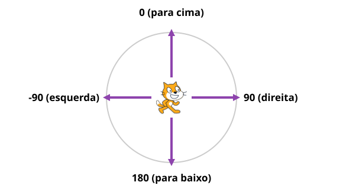
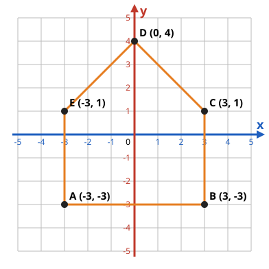

# Aula 2 — Onde está o gato? Coordenadas no Scratch

**Sexta, 02/10 · 16h às 17h · Roteiro do professor**

<div class="box" markdown="1">
**Ao final da aula, cada criança consegue:**

1. encontrar um ponto usando **dois números**: primeiro o **x** (para o lado), depois o **y** (para cima ou para baixo);
2. entender os **números negativos** como "antes do zero": à esquerda no eixo x, para baixo no eixo y;
3. saber que o gato começa no **centro do palco (0, 0)** e que o palco vai de **-240 a 240** no x e de **-180 a 180** no y;
4. usar os blocos `vá para x: y:`, `adicione … a x` e `adicione … a y`, e **mover o gato com as setas do teclado**.
</div>

## Antes da aula

- ☐ Ligar os computadores (igual à Aula 1).
- ☐ Projetor com `aula2-slides.pdf`.
- ☐ Imprimir a **Ficha 2** (12 + 3 extras) e a **folha de desafios** (`aula2-desafios.pdf`, 6 cópias).
- ☐ Desenhar no quadro, **antes das crianças chegarem**, uma grade de Batalha Naval de 6 × 6: colunas **A–F**, linhas **1–6**. Esconda 3 "navios" num papel só seu (ex.: B2, D5, F3).
- ☐ Deixar espaço no quadro para uma reta numérica e um plano cartesiano.

## Cronograma

| Tempo | Atividade | Material |
|---|---|---|
| 0–5 min | Revisão da Aula 1 | slide 2 |
| 5–13 min | Batalha Naval no quadro | quadro, slide 3 |
| 13–23 min | Números negativos e o plano cartesiano | slides 4–7, Ficha 2 (frente) |
| 23–30 min | O palco do Scratch é um plano! | slides 8–9, Ficha 2 (verso) |
| 30–36 min | Jogo: Caça às coordenadas | projeto `Aula2-CacaAsCoordenadas` |
| 36–54 min | Programando: os 4 cantos e as setas | slides 10–12, TurboWarp |
| 54–60 min | Mostre para a turma e encerramento | slide 13 |

## 1. Revisão (0–5 min)

Perguntas rápidas, com a mão levantada:

- *"O que é um programa?"* (uma lista de instruções, em ordem)
- *"Qual peça é o cérebro do computador?"* · *"E qual esquece tudo quando desliga?"*
- *"Qual bloco começa o programa quando clicamos na bandeira verde?"*

## 2. Batalha Naval (5–13 min)

Divida a turma em **dois times**. Cada time, na sua vez, "atira" dizendo uma **letra e um número** (ex.: *"C4!"*). Marque **X** para água e **●** para navio atingido.

**Pergunte depois:**

- *"Por que precisamos de **duas** informações para achar um lugar?"* (uma diz a **coluna**, a outra a **linha**)
- *"E se eu disser só 'C'?"* (pode ser qualquer casa daquela coluna!)

**Conclusão:** para achar um ponto precisamos de um **endereço com duas partes**. Na matemática (e no Scratch) usamos **números** para as duas: **(x, y)**.

## 3. Números negativos e o plano cartesiano (13–23 min)

**Números negativos** — comece por coisas que eles conhecem:

- **Termômetro:** aqui em Santana faz 30 °C, mas em lugares muito frios a temperatura fica **abaixo de zero**: -5 °C.
- **Elevador:** térreo é **0**; o 1º andar é **1**; o **subsolo** da garagem é **-1**, e o de baixo é **-2**.

Desenhe a **reta numérica** de -5 a 5 no quadro. **Pergunte:** *"O elevador estava no andar 2 e desceu 3 andares. Onde ele parou?"* (em -1)

**O plano cartesiano** = duas retas numéricas que se cruzam:

- a **deitada** é o **eixo x** (para os lados);
- a **em pé** é o **eixo y** (para cima e para baixo);
- onde elas se cruzam é a **origem (0, 0)**.

Marque no quadro: **A (2, 3)**, **B (-2, 3)**, **C (-3, -1)**, **D (4, -2)**. Sempre falando em voz alta:

<div class="box big center" markdown="1">
**Primeiro o x: ande para o lado. Depois o y: suba ou desça.**
x positivo ➡️ · x negativo ⬅️ · y positivo ⬆️ · y negativo ⬇️
</div>

As crianças fazem a **frente da Ficha 2**: completar a reta numérica e ler os pontos.

<div class="teacher" markdown="1">
**Atenção:** o erro mais comum é trocar a ordem (achar o y primeiro). Repita a frase *"primeiro anda, depois sobe"* sempre que alguém trocar. Os mais novos podem nunca ter visto número negativo — o elevador ajuda muito.
</div>

## 4. O palco do Scratch é um plano! (23–30 min)

Mostre o slide do palco:

- o gato começa no **centro: (0, 0)**;
- a borda **direita** é x = **240** e a **esquerda** é x = **-240**;
- o **topo** é y = **180** e o **fundo** é y = **-180**.

**Pergunte:** *"Se o gato for para x: 240, y: 0, onde ele para?"* (na borda direita, no meio da altura) · *"E para x: 0, y: -180?"*

As crianças fazem o **verso da Ficha 2**: escrever o endereço dos pontos no palco.

## 5. Jogo: Caça às coordenadas (30–36 min)

Cada um abre `Aula2-CacaAsCoordenadas` (pasta **Aulas**) e clica na **bandeira verde**. Uma estrela aparece no palco quadriculado; o gato pergunta **o x e o y da estrela**. Se acertar, ganha ponto. No canto aparece onde o **mouse** está (x e y) — incentive a passear com o mouse para "sentir" os números.

## 6. Programando (36–54 min)

Cada um clica em **Arquivo → Novo** (o gato volta ao centro).

**Parte A — Os 4 cantos.** Monte comigo:

```blocks
quando @greenFlag for clicado
vá para x: (0) y: (0)
deslize por (1) segs. até x: (200) y: (140)
deslize por (1) segs. até x: (-200) y: (140)
deslize por (1) segs. até x: (-200) y: (-140)
deslize por (1) segs. até x: (200) y: (-140)
```

**Pergunte:** *"Por que 200 e não 240?"* (em 240 o **centro** do gato fica na borda — metade do gato sai do palco!)

**Agora troque** os `deslize` por `vá para x: y:` e clique na bandeira. *"O que aconteceu?"* O gato **pula direto** para o último canto — rápido demais para ver! *"Como fazer o gato esperar um pouco em cada canto?"* → colocar `espere 1 seg` depois de cada `vá para`. **Lembre:** o computador faz exatamente o que mandamos, **muito rápido**.

**Parte B — O gato anda com as setas.** Monte o primeiro script comigo; os outros três eles descobrem:

```blocks
quando a tecla [seta para direita v] for pressionada
adicione (10) a x
```

**Pergunte:** *"E para a esquerda? Adicionar quanto ao x?"* (**-10**!) · *"E para cima?"* (adicionar 10 ao **y**) · *"E para baixo?"* (adicionar **-10** ao y)

<div class="teacher" markdown="1">
Andar com as setas volta nos **próximos jogos**. Quem terminar, deixe o gato andando com as 4 setas e **salve** (Arquivo → Salvar como...): no fim da aula vamos entregar o trabalho na **Sala**.
</div>

**Desafios:**

<div class="cols" markdown="1">
<div markdown="1">
**⭐ O gato olha para o lado certo.** Coloque `aponte para a direção (90)` na seta direita e `aponte para a direção (-90)` na esquerda. O gato ficou de ponta-cabeça? Use `defina o estilo de rotação para [esquerda-direita]` no início.

{.full}
</div>
<div markdown="1">
**⭐⭐ Pegue a estrela!** Adicione o ator **Star**: clique no botão redondo com o gatinho (embaixo, à direita) e escolha a estrela. Na estrela:

```blocks
quando @greenFlag for clicado
sempre
se <tocando em (Ator1 v)?> então
vá para (posição aleatória v)
end
end
```

*(**Ator1** é o nome do gato — ele aparece na lista do bloco)*
</div>
</div>

<div class="keep" markdown="1">

**⭐⭐⭐ Desafio extra — o gato desenha com coordenadas.** Clique no botão azul **no canto de baixo, à esquerda** (*Adicionar uma Extensão*) e escolha **Caneta**. Aparecem blocos verdes novos:

<div class="cols" markdown="1">
<div markdown="1">
```blocks
quando @greenFlag for clicado
apague tudo
vá para x: (-100) y: (-100)
use a caneta
vá para x: (100) y: (-100)
vá para x: (100) y: (100)
vá para x: (-100) y: (100)
vá para x: (-100) y: (-100)
levante a caneta
```
</div>
<div markdown="1">
**Pergunte:** *"Que figura vai aparecer?"* (um **quadrado**; deixe desenharem no quadro antes de clicar na bandeira) · *"Por que o primeiro `vá para` vem **antes** de `use a caneta`?"* (senão aparece um risco saindo do lugar onde o gato estava)

**Depois:** desenhar a **casa** do exercício 4 da Ficha 2, multiplicando cada número por **40**: (-120,&nbsp;-120) → (120,&nbsp;-120) → (120,&nbsp;40) → (0,&nbsp;160) → (-120,&nbsp;40) → (-120,&nbsp;-120).
</div>
</div>

</div>

<div class="teacher" markdown="1">
**Folha de desafios** (`aula2-desafios.pdf`, 8 cartões de ⭐ a ⭐⭐⭐): entregue para quem já tem o gato andando com as 4 setas. A criança escolhe **um** cartão, marca ☐ quando conseguir e mostra no encerramento. **Respostas:** triângulo → `repita (3) vezes` com `gire 120 graus` (3 × 120 = 360, a volta inteira, como o 24 × 15 da Aula 1) · a casa: as coordenadas acima.
</div>

## 7. Mostre para a turma e encerramento (54–60 min)

- Duas ou três crianças mostram o gato andando pelas setas no projetor (ou "galeria").
- **Perguntas finais:** *"Onde o gato mora quando começa?"* (0, 0) · *"x é para o lado ou para cima?"* · *"Andar para a esquerda é x positivo ou negativo?"*
- **Próxima aula:** *"Vamos criar o nosso **primeiro jogo**: pegar as frutas que caem do céu!"*

## Gabarito da Ficha 2 {style="break-before: page"}

<div class="cols" markdown="1">
<div markdown="1">
**1.** Reta: -5, -4, -3, -2, -1, 0, 1, 2, 3, 4, 5 · **a)** -1 (1º subsolo) · **b)** 1 · **c)** 3 °C

**2.** A (3, 2) · B (-4, 3) · C (-2, -3) · D (4, -1) · E (0, -4)

**3.** esquerda: **-10** · cima: **10** · baixo: **-10**

**5.** A (240, 0) · B (0, 180) · C (-240, -180) · D (-120, 90) · E (120, -90)
</div>
<div markdown="1">
**4.** É uma **casa**:

{.full}
</div>
</div>
