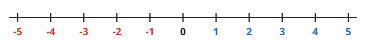
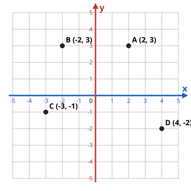
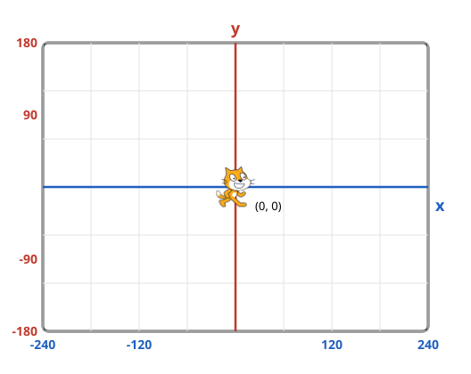

---slide--- title-slide

# Programação para crianças

## Aula 2 — Onde está o gato? 🐱📍

---slide---

# Lembra da última aula? 🤔

- O que é um **programa**?
- Qual peça é o **cérebro** do computador?
- Qual peça **esquece tudo** quando desliga?
- Qual bloco **começa** o programa?

---slide---

# Batalha Naval 🚢

Para achar um navio, precisamos de **duas** informações:

<div class="big center" markdown="1">
a **coluna** (letra) e a **linha** (número)

**C4** 🎯
</div>

---slide---

# Números negativos ❄️🛗

<div class="cols" markdown="1">
<div markdown="1">
**Termômetro** 🌡️

- aqui em Santana: **30 °C**
- num lugar muito frio: **-5 °C**, abaixo de zero!
</div>
<div markdown="1">
**Elevador** 🛗

- 1º andar: **1**
- térreo: **0**
- subsolo: **-1** e **-2**
</div>
</div>

---slide---

# A reta numérica

{.full}

<div class="big center" markdown="1">
⬅️ **negativos** · · · **0** · · · **positivos** ➡️
</div>

---slide---

# O plano cartesiano

<div class="split even" markdown="1">
<div markdown="1">
{.full}
</div>
<div markdown="1">
- **eixo x**: deitado, para os lados ➡️
- **eixo y**: em pé, para cima ⬆️
- **origem**: o ponto **(0, 0)**, onde os eixos se cruzam
</div>
</div>

---slide---

# A regra de ouro ⭐

<div class="big center" markdown="1">
**(x, y)**

**Primeiro o x:** ande para o lado ➡️⬅️

**Depois o y:** suba ou desça ⬆️⬇️
</div>

---slide---

# O palco do Scratch é um plano!

<div class="split even" markdown="1">
<div markdown="1">
{.full}
</div>
<div markdown="1">
- o gato começa no **centro (0, 0)**
- **x** vai de **-240** a **240**
- **y** vai de **-180** a **180**
</div>
</div>

---slide---

# Onde o gato vai parar? 🤔

<div class="big" markdown="1">
- `vá para x: 240 y: 0` → ?
- `vá para x: 0 y: -180` → ?
- `vá para x: -240 y: 180` → ?
</div>

---slide---

# Os 4 cantos

<div style="zoom: 0.72" markdown="1">

```blocks
quando @greenFlag for clicado
vá para x: (0) y: (0)
deslize por (1) segs. até x: (200) y: (140)
deslize por (1) segs. até x: (-200) y: (140)
deslize por (1) segs. até x: (-200) y: (-140)
deslize por (1) segs. até x: (200) y: (-140)
```

</div>

E se trocar `deslize` por `vá para`? 🤔

---slide---

# O gato anda com as setas

```blocks
quando a tecla [seta para direita v] for pressionada
adicione (10) a x
```

E as outras setas? Adicionar ao **x** ou ao **y**? **Quanto**?

---slide---

# Desafios ⭐

<div class="split even" markdown="1">
<div markdown="1">
**⭐ O gato olha para o lado certo**

`aponte para a direção (90)`

{.full}
</div>
<div markdown="1">
**⭐⭐ Pegue a estrela!**

Adicione o ator **Star** e faça a estrela pular para uma **posição aleatória** quando o gato tocar nela.
</div>
</div>

---slide---

# Hoje aprendemos 🎉

- um ponto tem **endereço**: **(x, y)**
- **primeiro o x**, depois o **y**
- **negativo** = para a **esquerda** ou para **baixo**
- o gato começa no **(0, 0)**, o centro do palco

**Próxima aula:** o nosso **primeiro jogo** — pegar as frutas que caem do céu! 🍎
