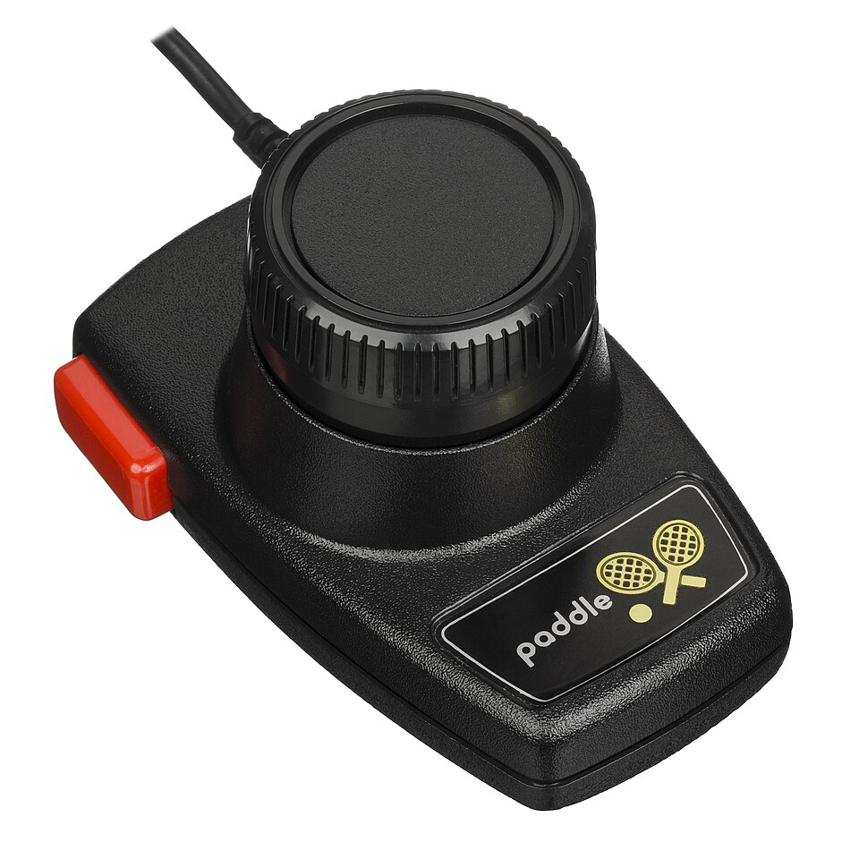
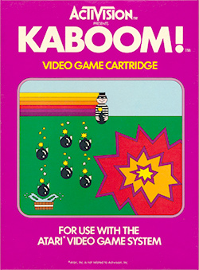

---slide--- title-slide

# Programação para crianças

## Aula 3 — Pega-frutas 🍎🥣

---slide---

# Lembra da última aula? 🤔

- Onde o gato **mora** quando começa?
- Andar para **baixo** é y **positivo** ou **negativo**?
- Qual é a **regra de ouro** do (x, y)?

---slide---

# Hoje na Sala: Kaboom! 💣

<div class="big" markdown="1">
1. Abra o Firefox e clique em **Sala**
2. Escolha o seu **nome**
3. Jogue o **Kaboom!**: **x** começa, **setas ← →** mexem os baldes
</div>

---slide---

# Kaboom! (1981) 💣

<div class="split" markdown="1">
<div markdown="1">
- **Atari 2600**, 1981
- o **Bombardeiro Maluco** solta bombas; você pega com **baldes de água**
- o controle era um **botão de girar**
- vendeu **mais de 1 milhão**!
</div>
<div markdown="1">
{style="max-height: 100mm; display: block; margin: 0 auto"}
</div>
</div>

<p class="small muted">Foto: Evan-Amos, Wikimedia Commons (domínio público)</p>

---slide---

# Quem fez o Kaboom!? 🎮

<div class="split" markdown="1">
<div markdown="1">
- **1979:** programadores da **Atari** criam a **Activision**
- o **nome de quem programou** vinha no manual
- **muitos pontos?** Foto da TV pelo correio = um **emblema**!
</div>
<div markdown="1">
{style="max-height: 100mm; display: block; margin: 0 auto"}
</div>
</div>

<p class="small muted">Capa: Activision, via Wikipédia (uso ilustrativo)</p>

---slide---

# Como você programaria? 🤔

<div class="big" markdown="1">
- Quais são os **personagens**?
- O que **cada um** faz?
- Quando a gente **ganha ponto**?
</div>

---slide---

# A tigela 🥣

<div class="big" markdown="1">
- fica sempre **embaixo**: **y = -150**
- anda **para os lados** junto com o mouse
- o **x** da tigela é o **x do mouse** ⬅️➡️
</div>

---slide---

# A fruta 🍎

<div class="big" markdown="1">
- nasce **no alto** (y = 180), num **x sorteado**
- **cai**: o y **diminui** ⬇️ `adicione (-5) a y`
- chegou lá embaixo? **volta para o alto**
- caiu na tigela? **ponto!** e volta para o alto
</div>

---slide---

# Variável: uma caixa com nome 📦

<div class="big center" markdown="1">
**pontos** ➡️ 📦 **0**

Pegou uma fruta? A caixa agora guarda **1**. Depois **2**, **3**…

O jogo **olha dentro da caixa** para mostrar os pontos.
</div>

---slide---

# Passo 1: a tigela 🥣

Na **Tigela**:

<div style="zoom: 0.9" markdown="1">

```blocks
quando @greenFlag for clicado
sempre
  vá para x: (posição x do mouse) y: (-150)
end
```

</div>

E se tirar o `sempre`? 🤔

---slide---

# Passo 2: a fruta cai e volta

<div style="zoom: 0.68" markdown="1">

```blocks
quando @greenFlag for clicado
vá para x: (número aleatório entre (-200) e (200)) y: (180)
sempre
  adicione (-5) a y
  se <(posição y) < (-170)> então
    vá para x: (número aleatório entre (-200) e (200)) y: (180)
  end
end
```

</div>

---slide---

# Passo 3: os pontos

**Variáveis → Criar uma Variável → pontos** · no começo: `mude [pontos] para (0)`

<div style="zoom: 0.78" markdown="1">

```blocks
se <tocando em (Tigela v)?> então
  adicione (1) a [pontos v]
  vá para x: (número aleatório entre (-200) e (200)) y: (180)
end
```

</div>

Por que a fruta precisa **voltar para o alto**? 🤔

---slide---

# Passo 4: fruta surpresa 🎁

Depois de **cada** `vá para x: … y: (180)`:

<div markdown="1">

```blocks
mude para a fantasia (número aleatório entre (1) e (5))
```

</div>

A Fruta tem **5 fantasias**: maçã, banana, laranja, melancia e morango!

---slide---

# Salvar e entregar 💾

<div class="big" markdown="1">
1. **Arquivo → Salvar como...** → nome **PegaFrutas**
2. Clique em **Entregar trabalho** (na área de trabalho)
3. Pronto! Na Sala, em **Meus arquivos**, ele fica guardado
</div>

---slide---

# Desafios ⭐

<div class="big" markdown="1">
- ⭐ Fruta **mais rápida**
- ⭐ **Som** quando pegar
- ⭐⭐ **Três vidas**
- ⭐⭐⭐ Cuidado com a **pedra**!
</div>

---slide---

# Hoje aprendemos 🎉

- a tigela segue o **x do mouse**
- para **cair**, o y **diminui**
- **número aleatório** = sorteio 🎲
- **variável** = uma caixa com nome que guarda um número

**Próxima aula:** o **Pong**, um dos videogames mais famosos da história! 🏓
