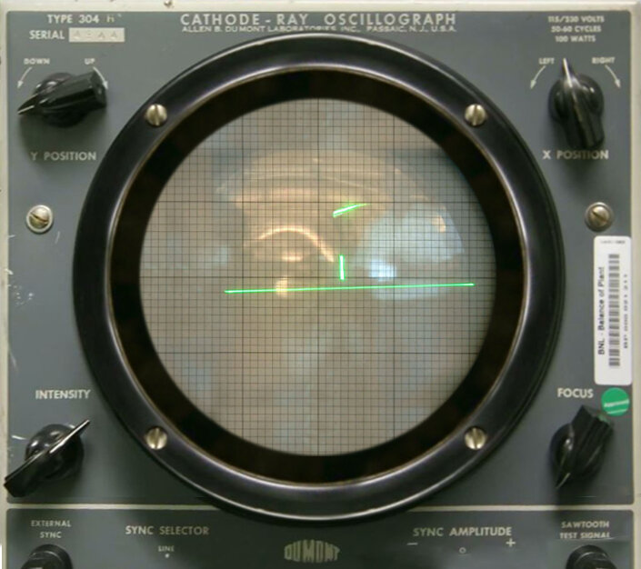
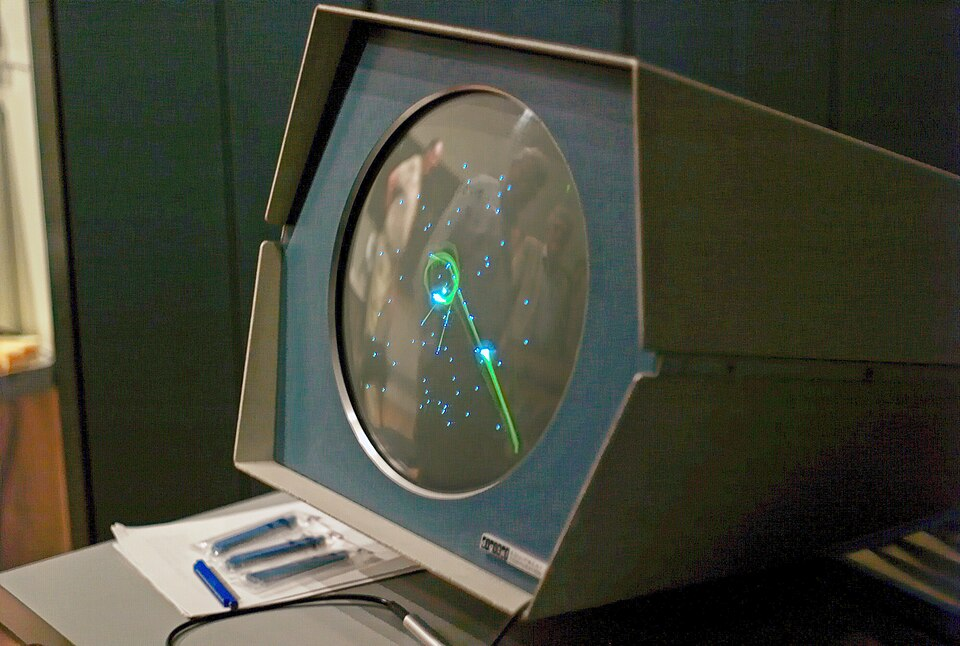
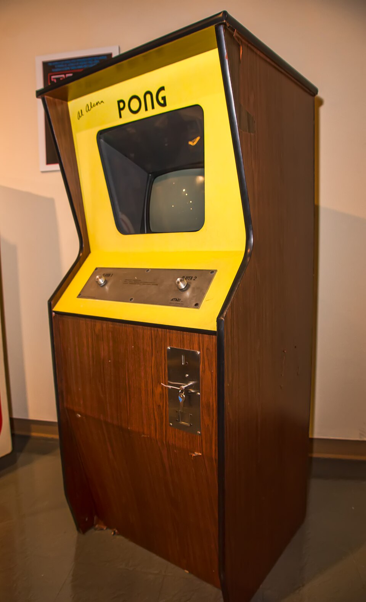

---slide--- title-slide

# Programação para crianças

## Aula 4 — Pong: a bola e as raquetes 🏓

---slide---

# Lembra da última aula? 🤔

- O que é uma **variável**?
- Para a fruta **cair**, o y **aumenta** ou **diminui**?
- Que bloco faz um **sorteio**?

---slide---

# Hoje na Sala: Pong 🏓

<div class="big" markdown="1">
1. Abra a **Sala** e escolha o seu **nome**
2. Jogue o **Pong** contra o computador
3. **Setas** (ou **W** e **S**) mexem a raquete
</div>

---slide---

# Antes do Pong 🕹️

<div class="split" markdown="1">
<div markdown="1">
- **1958 — Tennis for Two:** tênis num **osciloscópio**
- **1962 — Spacewar!:** duas naves num computador **gigante**
</div>
<div markdown="1">
{style="max-height: 40mm; display: block; margin: 0 auto 2mm"}
{style="max-height: 40mm; display: block; margin: 0 auto"}
</div>
</div>

<p class="small muted">Fotos, Wikimedia Commons: Brookhaven National Laboratory (domínio público, em cima); Joi Ito (CC BY 2.0, embaixo)</p>

---slide---

# Pong (1972) 🏓

<div class="split" markdown="1">
<div markdown="1">
- feito pela **Atari**, criado por **Allan Alcorn**
- a máquina de teste foi para um **bar** e "quebrou": a **caixa de moedas** estava **cheia demais**! 🪙
- o **primeiro grande sucesso** dos videogames
</div>
<div markdown="1">
{style="max-height: 100mm; display: block; margin: 0 auto"}
</div>
</div>

<p class="small muted">Foto: Chris Rand, Wikimedia Commons (CC BY-SA 3.0)</p>

---slide---

# Como você programaria? 🤔

<div class="big" markdown="1">
- Quais são os **personagens**?
- O que **cada um** faz?
- Como a bola sabe **para onde ir**?
</div>

---slide---

# A bola anda sozinha ➡️⬆️

<div class="big center" markdown="1">
A cada instante: **5 para o lado** e **3 para cima**

(0, 0) → (5, 3) → (10, 6) → (15, 9) …

**vx** = velocidade no **x** · **vy** = velocidade no **y**
</div>

---slide---

# Bateu, virou! 🔄

<div class="big center" markdown="1">
Bateu **em cima** ou **embaixo**: troca o sinal do **vy**

**3** ➡️ **-3** · · · **-3** ➡️ **3**
</div>

```blocks
mude [vy v] para ((0) - (vy))
```

---slide---

# A raquete é uma parede que anda 🧱

<div class="big" markdown="1">
- Bateu **do lado** ou numa **raquete**: troca o sinal do **vx**
- **Raquete1** (esquerda): teclas **W** e **S**
- **Raquete2** (direita): **setas** ⬆️⬇️
</div>

---slide---

# Passo 1: a bola anda

Crie as variáveis **vx** e **vy**. Na **Bola**:

<div style="zoom: 0.6" markdown="1">

```blocks
quando @greenFlag for clicado
vá para x: (0) y: (0)
mude [vx v] para (5)
mude [vy v] para (número aleatório entre (2) e (4))
sempre
  adicione (vx) a x
  adicione (vy) a y
end
```

</div>

---slide---

# Passo 1: as 4 paredes

Dentro do **sempre**:

<div class="cols" markdown="1" style="zoom: 0.55">
<div markdown="1">

```blocks
se <(posição y) > (174)> então
  mude [vy v] para ((0) - (vy))
end
se <(posição y) < (-174)> então
  mude [vy v] para ((0) - (vy))
end
```

</div>
<div markdown="1">

```blocks
se <(posição x) > (234)> então
  mude [vx v] para ((0) - (vx))
end
se <(posição x) < (-234)> então
  mude [vx v] para ((0) - (vx))
end
```

</div>
</div>

A bola **nunca para**? 🎉

---slide---

# Passo 2: a raquete que engasga 😖

<div class="split even" markdown="1">
<div markdown="1">

```blocks
quando a tecla [w v] for pressionada
adicione (8) a y
```

</div>
<div markdown="1">
Segure o **W**…

anda, **para**, e só depois continua!

Num jogo, isso **não serve**.
</div>
</div>

---slide---

# Passo 2: a raquete lisinha 😎

<div class="split" markdown="1">
<div style="zoom: 0.5" markdown="1">

```blocks
quando @greenFlag for clicado
vá para x: (-200) y: (0)
sempre
  se <tecla [w v] pressionada?> então
    adicione (8) a y
  end
  se <tecla [s v] pressionada?> então
    adicione (-8) a y
  end
end
```

</div>
<div markdown="1">
**Raquete2:**

x: **200**

**seta para cima**

**seta para baixo**
</div>
</div>

---slide---

# Passo 3: rebater 🏓

Na **Bola**, dentro do **sempre**:

<div style="zoom: 0.6" markdown="1">

```blocks
se <<tocando em (Raquete1 v)?> e <(vx) < (0)>> então
  mude [vx v] para ((0) - (vx))
end
se <<tocando em (Raquete2 v)?> e <(vx) > (0)>> então
  mude [vx v] para ((0) - (vx))
end
```

</div>

Para que serve o **e (vx) < 0**? 🤔

---slide---

# Salvar e jogar em dupla 💾

<div class="big" markdown="1">
1. **Arquivo → Salvar como...** → **Pong**
2. **Entregar trabalho**: vamos continuar na próxima aula!
3. Dupla: **W e S** × **setas**
</div>

---slide---

# Desafios ⭐

<div class="big" markdown="1">
- ⭐ A raquete **não foge** da tela
- ⭐ Bola **mais rápida**
- ⭐⭐ **Contador** de toques
- ⭐⭐⭐ Um **obstáculo** no meio
</div>

---slide---

# Hoje aprendemos 🎉

- a bola anda com **vx** e **vy**
- bateu, **troca o sinal**: `(0) - (vy)`
- `sempre` + `se <tecla … pressionada?>` = raquete **lisinha**
- a raquete é uma **parede que anda**

**Próxima aula:** o **placar** e as **regras** — quem fizer 5 pontos, ganha! 🏆
